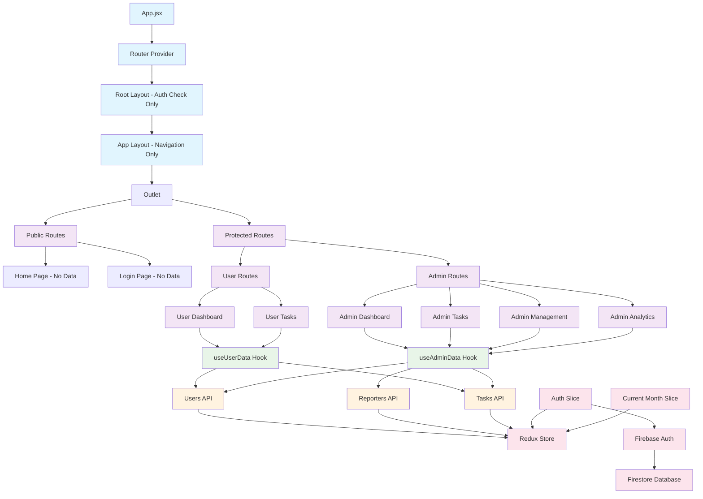

# Task Tracker App - Current Architecture

## Mermaid Diagram

## Architecture Summary

### 🏗️ **Clean Architecture Principles**

1. **Separation of Concerns**: Each layer has a single responsibility
2. **Data Flow**: Unidirectional data flow from API → Store → Components
3. **Role-Based Access**: Different data hooks for different user roles
4. **Route Protection**: Centralized in ProtectedRoute component

### 📊 **Data Fetching Strategy**

- **useUserData**: Fetches current user's data and tasks only
- **useAdminData**: Fetches all users, reporters, and tasks
- **No Redundant Fetching**: Each page fetches only what it needs
- **Cached Data**: RTK Query handles caching and deduplication

### 🔐 **Security & Access Control**

- **Route-Level Protection**: ProtectedRoute handles authentication
- **Role-Based Data**: Users only see their own data, admins see all
- **No Client-Side Security**: All security is enforced at the API level

### 🎯 **Key Benefits**

1. **Performance**: No over-fetching of data
2. **Maintainability**: Clear separation of concerns
3. **Scalability**: Easy to add new features and roles
4. **Security**: Proper access control at every level
